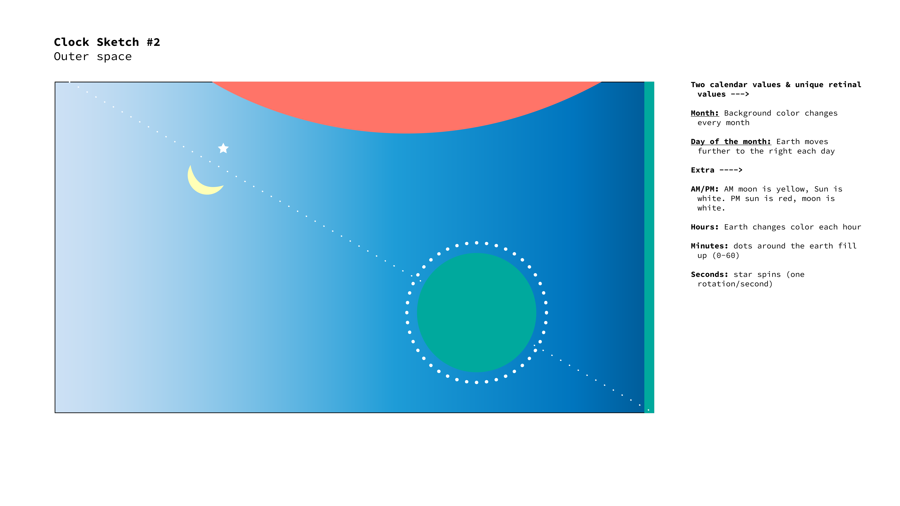
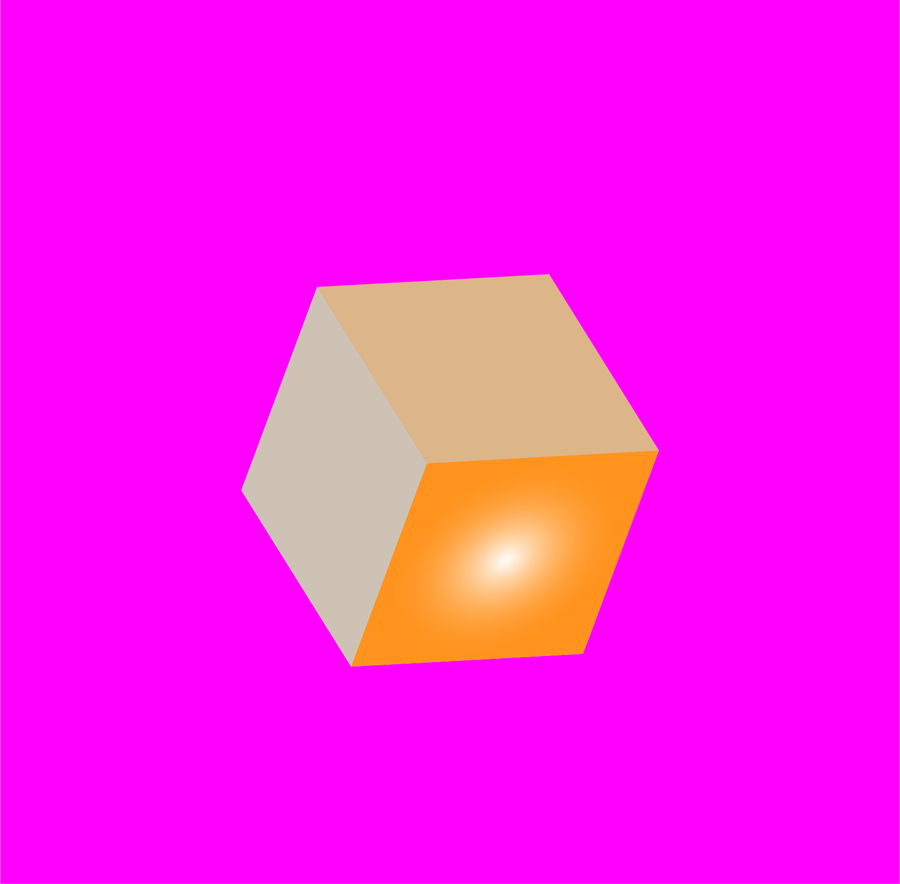

# Process
This readme describes the process for weeks 02-04 clock and date sketches

## Week 04 In-Class Hybrid Sketches

**1. Alopecia**

Season: eye color dark brown -> blue -> green -> light brown

Moon cycle: pupil small to large

Month: eyelash falls off

Hour: tear falls to bottom of screen

Minute: eyebrow fills

Second: eyebrow furrow moves position

**2. Solar**

Year: Dot is added to diagonal line each year

Month: Moon rotates 180 degrees

Weekday: Number of stars increase 1->7

Hour progress: Right circle grows

Minute progress: Middle circle grows & changes color

Second progress: Right circle grows & moves up/down on y axis

**3. Sunset**

Month: Color gradient of the second bar changes

Day: Slider moves on top bar from left to right

Hour: Icons rotate clockwise

Minute: Second bar grows from right to left

Second: White dot in second bar grows in size

## Week 04 Final Clock & Date Coded Sketches Documentation

### Final Coded Date Sketches
1. Alopecia - Brow furrow moves left to right based on season, eyelashes fade throughout the month, eyebrow fill fades  throughout the year, eyebrow texture fades throughout the moon cycle, tear falls to bottom of the page throughout the month.

2. Solar - Diameter of the white moving particles increases throughout the moon cycle, yellow ‘planet’ moves from top left corner to bottom right corner throughout the month.

3. City skyline - Background color changes based on season, city skyline moves from left to right throughout week, diameter of red circle increases/decreases and moves up/down throughout moon cycle. I adapted this to a date sketch from a prior clock sketch because I thought it was better suited to show longer time periods.

### Final Coded Clock Sketches
1. Lines-ellipse: Dot moves left to right every second, red and green lines ‘grow’ to fill screen within a minute, rotating circles in the back turn black when PM.

  

2. Box - Point light color and position changes every second, background color changes throughout the hour, angle of rotation increases throughout each minute.

3. Icons - Icons move down within hour, colored rectangle moves left to right throughout day, color of rectangle changes every minute, dot moves right and changes color when PM. I adapted this from a prior date sketch to a be clock sketch because I thought it was better suited to show time of day given that the icons correspond to daily activities.

---

## Week 03 Clock Sketches Documentation

### Sketch 01 - Seasons of Alopecia
This sketch maps years and months using the retinal variables of texture and shape. I have an autoimmune condition called alopecia, which causes my body to attach my hair follicles and cause my hair to fall out periodically. This often progresses throughout the year and fluctuates month to month. This sketch tries to capture the essence of time by showing the disappearance of eyebrow hair and eye lashes over time.  

  

### Sketch 02 - Outer Space
This sketch captures month (0-12) and day of month (0-[28-31]) using the retinal variables of color and position. The sketch resembles a solar system, with the background color changing each month and the 'earth-like' object changing position based on day of the month. I suspect the day of the month may be harder to code since this number changes month to month throughout the year.  

  

### Sketch 03 - Sunset Slider
The final sketch includes season and day of the week using retinal variables of size and shape/hue/position. Here image based icons are used to represent time of day, and these icons change hue and position based on the day of the week. Seasons are shown by a white line that increases in size from top to bottom of the right hand gradient bar.  

---

## Week 02 Date Sketches Documentation

### Concept 1: City Skyline
In this clock sketch, the city skyline of New York will move right to left over the duration of a minute. The background color will change from light blue to dark blue over the course of the hour, and the rate of particles falling will increase every second.

  

**In progress result:**
I was able to code the minute and hour components, but not the second component for the particles.  

  

### Concept 2: Spinning Box
In this clock sketch, the background changes over the course of the hour, the box moves faster throughout the minute, and the light position changes every second.

  

**In progress result:**

  

### Concept 3: Moving Particles
In this sketch the background ellipses move based on the hour, the lines move from top to bottom over a minute, and the the ellipse moves from right to left over a minute.

  

**In progress result:**

