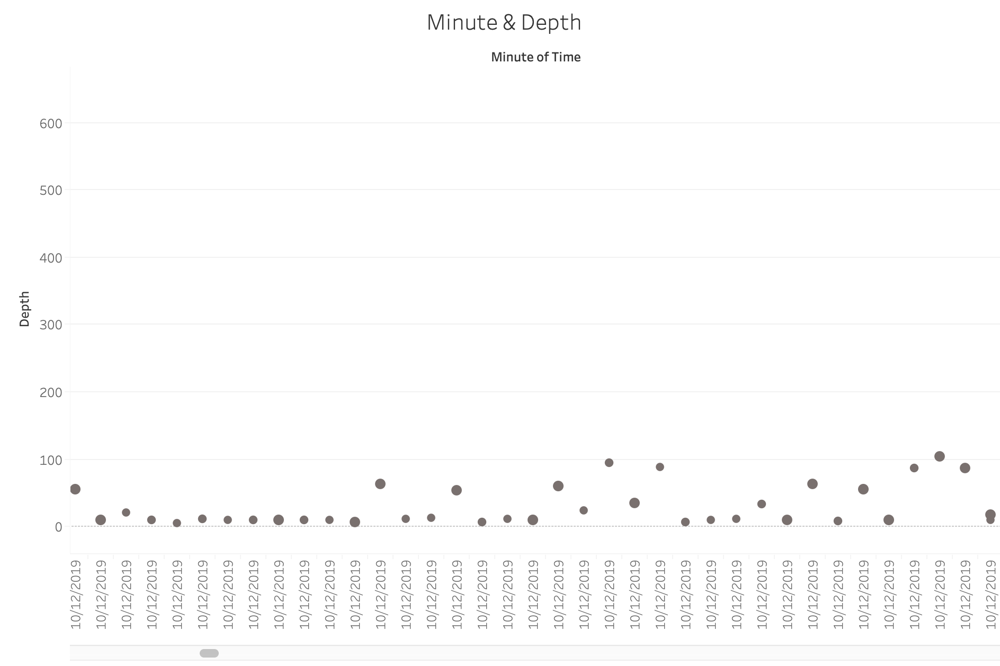
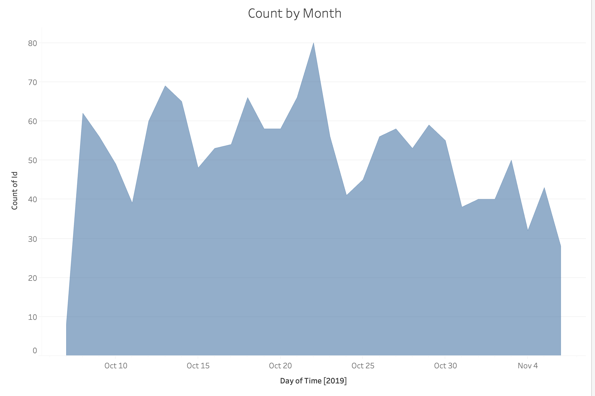
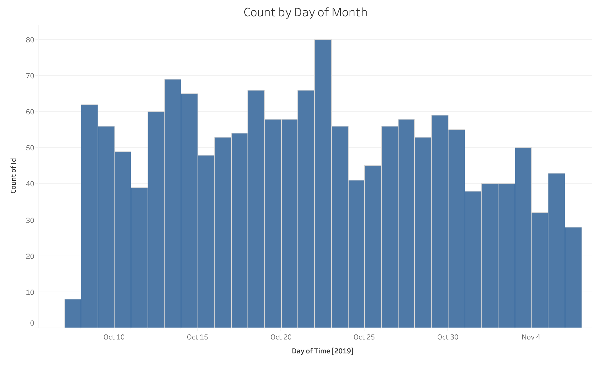
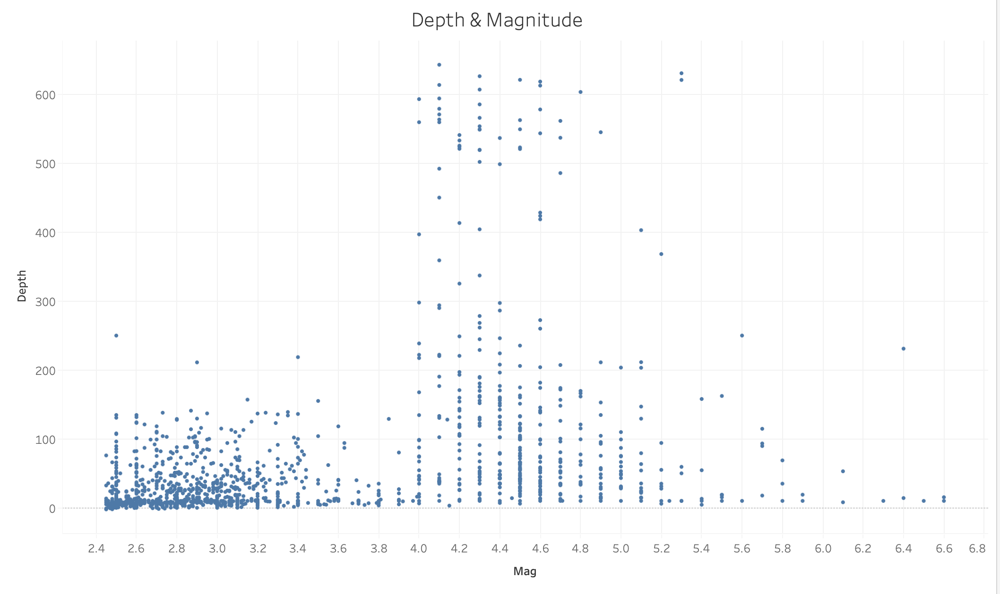
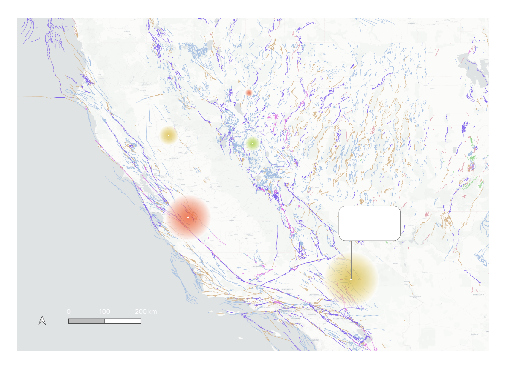
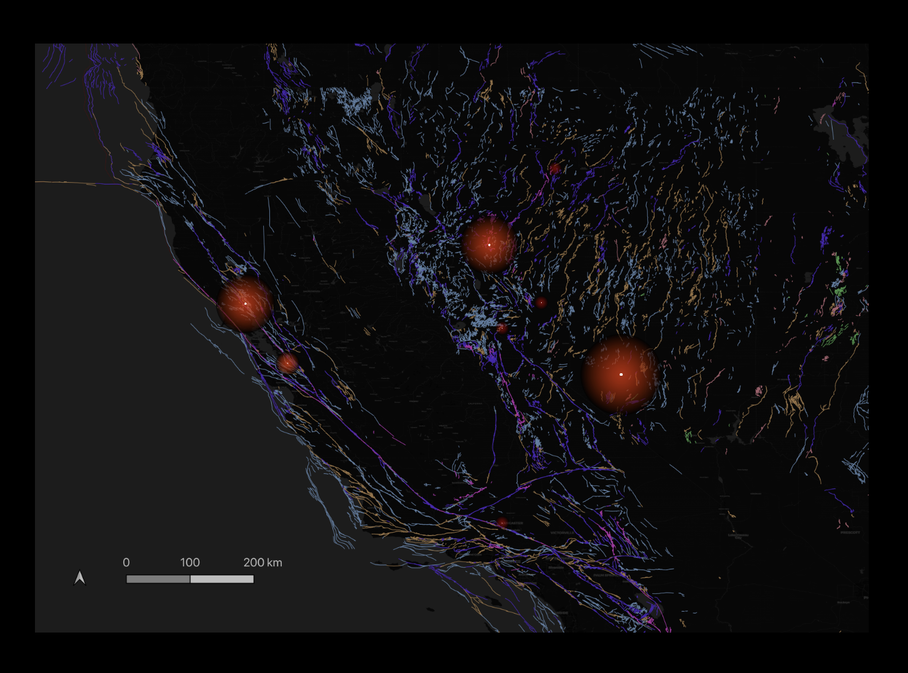
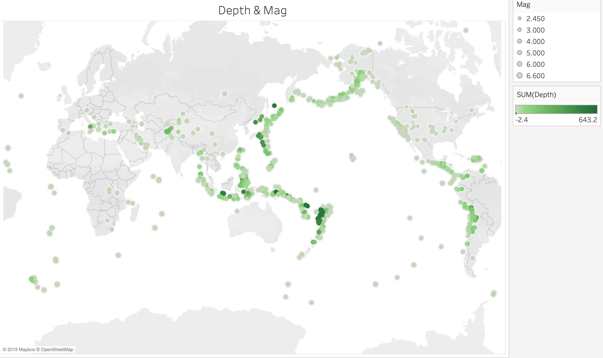
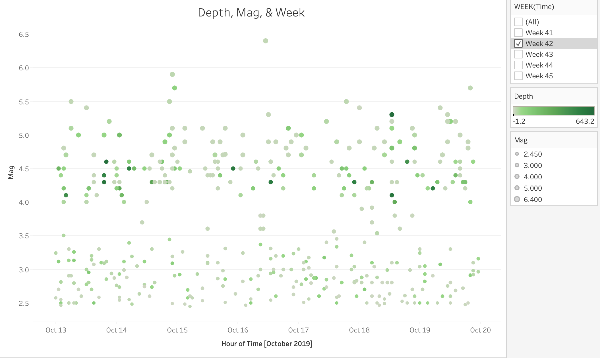
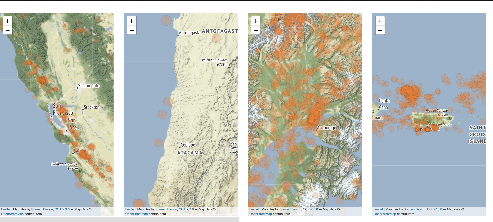

## Process

Listing of the contents of this folder and a prose description of your ideas for how to represent
the earthquake data geospatially and diagrammatically.

### Preliminary sketches for earthquake data

###### Depth on the y axis, date/time on the x axis (to the minute), and magnitude for radius.

###### Area chart of count of earthquakes sorted by day

###### Similar to area chart but using bars instead

###### depth vs magnitude

###### Fault line data + magnitude for radius of earthquake marker

###### Dark version of fault line sketch

###### Preliminary map with magnitude for radius and depth mapped to color

###### depth vs magnitude with time mapped to color

###### Magnitude vs hour

###### Preliminary hotspot maps

